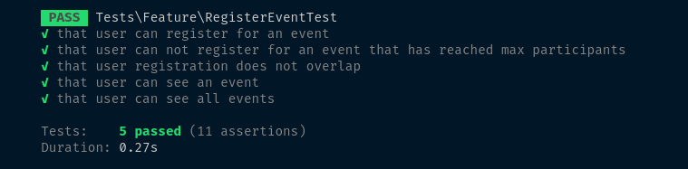

## Project Structure Overview

- We use a **controller** to prepare data for the client and a **service class** to encapsulate our business logic.
- Feature tests have been written to cover all essential scenarios.
- Frontend data is wrapped using **resource classes** for consistency.

---

## Running the Project

1. Run `composer install` to set up dependencies.
2. To verify functionality, execute the tests located at `tests/Feature/RegisterEventTest.php` by running:
   ```bash
   php artisan test
