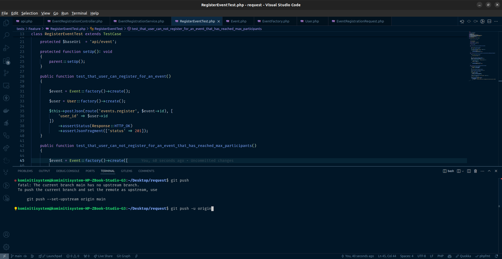

## This is a summary of what the project is structured
 
- We have a controller to prepare data that can be used on the client and service class to wrap our logic
- Wrote feature tests to cover the necessary cases. 
- We are wrapping our FE data with resource

#### To run the project. 
- Run composer install
- I wrote tests cases (tests/feature/RegisterEventTest.php) so you just run "php artisan test" to see all the scenerios highlited in the docs. 

